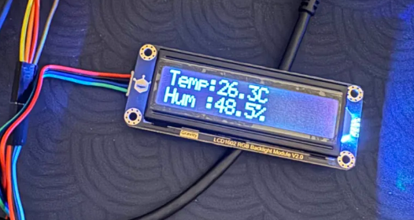

## ESP32 I2C Temperature/Humidity Sensor

A native C++ embedded systems project on the ESP32C3 that drives an I2C LCD
and an I2C temperature/humidity sensor over a single shared bus, with live
sensor readings refreshed once per second directly on-device.

**Stack:** ESP-IDF · C++ · I2C (`driver/i2c.h`) · FreeRTOS

### Overview

Ported and extended a display driver originally written for Arduino to run
natively on ESP-IDF, then built a real-time sensor readout pipeline that
shares the same I2C bus between the display and the sensor.

### Highlights

- **Bare-metal I2C bus sharing** — a single I2C peripheral, initialized once,
  drives two independent devices (display + sensor) at different addresses
- **Live sensor telemetry** — temperature (°C) and humidity are read from the
  sensor and rendered to the display on a 1-second refresh loop
- **RTOS-driven timing** — refresh cadence handled with FreeRTOS `vTaskDelay`
  rather than blocking delays, keeping the loop non-blocking and predictable

### How it works

The display and sensor communicate over the same SDA/SCL pins using distinct
7-bit I2C addresses. The I2C driver is installed once for the shared port,
and both device drivers reuse that same `i2c_port_t` handle — avoiding the
double-install/conflict issues common when combining libraries written for
different platforms.
